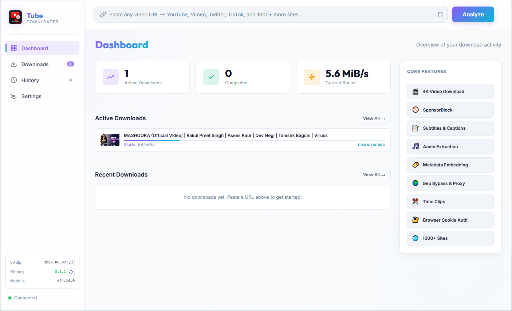

<div align="center">


<h1>Tube Downloader</h1>

<p><strong>A professional-grade, self-hosted media download manager<br>powered by yt-dlp — beautifully wrapped in a modern web UI.</strong></p>

<p>
  
  
  
  
  
  
</p>

<br/>



</div>

---

## What is Tube Downloader?

**Tube Downloader** is a self-hosted web application that gives you a beautiful, glassmorphic GUI for `yt-dlp` — the most powerful command-line media downloader available. Paste any URL from YouTube, TikTok, Vimeo, Twitter/X, Instagram, and 1,000+ other sites, configure every detail through a clean 4-tab modal, and watch real-time progress with speed graphs — all from your browser, all running locally on your machine.

No cloud. No subscriptions. No data collection. Just downloads.

---

## 🚀 Feature Highlights

### 🎬 Video & Audio Downloads

| Feature | Details |
|---|---|
| **Video Quality** | Best Auto, 4K UHD (2160p), 2K QHD (1440p), Full HD (1080p), HD (720p), SD (480p), Low (360p) |
| **Output Format** | Always merges to MP4 via FFmpeg |
| **Audio Extraction** | MP3, AAC, Opus, FLAC, M4A, WAV, Vorbis with configurable quality (0–10) |
| **Playlist Support** | Full playlist, item range selection (e.g. `1:5`, `1,3,5-8`), or single-video override |
| **Time Clipping** | Download specific time ranges from any video |
| **Live Streams** | Download live streams from the start or wait for scheduled streams |
| **Multi-Site** | 1,000+ supported sites via yt-dlp |

### 📊 Real-Time Dashboard

- **Active download cards** — thumbnail, title, animated progress bar, speed text, ETA
- **Speed sparkline graph** — per-download canvas chart tracking MB/s in real time (last 60 data points)
- **Stats grid** — aggregated active count, completed count, and total current bandwidth
- **Live status chips** — Queued → Downloading → Merging → Processing → Completed / Failed
- **Toast notifications** — success/error/info pop-ups with auto-dismiss

### 🌐 Real-Time Communication (WebSocket)

The server and browser stay in sync via a persistent WebSocket (`/ws`). Every state change — progress ticks, completion, failure, settings updates — is pushed immediately with no polling.

### 🚫 SponsorBlock Integration

Uses the crowdsourced [SponsorBlock](https://sponsor.ajay.app/) database (via yt-dlp) to:
- **Remove** segments from the final file (Sponsor, Intro, Outro, Self-Promo, Preview, Filler, Interaction, Music Offtopic)
- **Mark** segments as chapters (works alongside chapter embedding)

### 📝 Subtitles

- Download manual subtitles or auto-generated captions
- Embed subtitles directly into the video container
- Select languages (e.g. `en`, `en,es,fr`, or `all`)
- Output formats: SRT, WebVTT, ASS/SSA, LRC

### 🏷️ Metadata & Post-Processing

- Embed thumbnail image into video/audio files
- Embed full metadata: title, uploader, description, tags
- Add chapter markers from source chapter data
- Write `.info.json` metadata sidecar file
- Write thumbnail image to disk as a separate file

### 🌍 Network & Proxy

- HTTP, HTTPS, and SOCKS5 proxy support
- Force IPv4 or IPv6 connections
- X-Forwarded-For geo-restriction bypass (US, GB, DE, JP, CA, AU, FR)
- Configurable socket timeout

### 🔐 Authentication

- Import cookies from Chrome, Firefox, Edge, Brave, Opera, Safari, or Chromium — for age-restricted and member-only content
- Optional username/password login for supported sites

### ⚡ Advanced Download Options

| Option | Details |
|---|---|
| **Speed Limit** | 256 KB/s up to 10 MB/s or Unlimited |
| **Concurrent Fragments** | Parallel DASH/HLS segment downloads (1–16) |
| **Max Retries** | Configurable per-download and fragment retry count |
| **No Overwrites** | Skip files that already exist on disk |
| **Resume** | Continue interrupted partial downloads |
| **External Downloader** | Native, aria2c, curl, wget, FFmpeg |
| **Download Archive** | Track already-downloaded videos to avoid duplicates |

### 🎨 Themes & Appearance

Five built-in accent themes with full light and dark mode support:

| Theme | Primary | Secondary |
|---|---|---|
| 🟣 **Violet Glow** (default) | `#8b5cf6` | `#06b6d4` |
| 🔵 **Cyber Cyan** | `#06b6d4` | `#3b82f6` |
| 🟢 **Emerald** | `#10b981` | `#06b6d4` |
| 🟡 **Solar Amber** | `#f59e0b` | `#ef4444` |
| 🔴 **Rose Red** | `#f43f5e` | `#a855f7` |

### 🔄 In-App Tool Updater

Update your tools without ever leaving the browser:
- **yt-dlp** — updated via `pip install -U yt-dlp` (auto-detects virtualenv)
- **FFmpeg** — updated via `winget install Gyan.FFmpeg`

Live terminal output is streamed directly to the UI while the update runs.

---

## 🏗️ Architecture Overview

```
tube_downloader/
├── server.js           ← Express + WebSocket server, yt-dlp process manager
├── package.json        ← Node.js dependencies
├── downloads.json      ← Persistent download history (auto-created)
├── settings.json       ← Persistent user settings (auto-created)
└── public/
    ├── index.html      ← Single-page application shell (4 pages, 7 settings tabs, 4 modal tabs)
    ├── app.js          ← Full SPA frontend — WebSocket client, state, rendering, UI logic
    └── styles.css      ← Premium design system — themes, glassmorphism, animations
```

```
Browser  <──── WebSocket (ws://localhost:3000/ws) ────>  server.js
Browser  <──── REST API  (HTTP/JSON) ─────────────────>  server.js
server.js ──>  spawn(python -m yt_dlp ...) ──>  Downloads folder
```

### Backend (`server.js`)

| Component | Description |
|---|---|
| **Express** | Serves the static frontend and REST API |
| **WebSocket Server** | Broadcasts live download state to all connected browsers |
| **yt-dlp Process Manager** | Spawns, monitors, parses stdout, and kills yt-dlp child processes |
| **Persistent Storage** | `downloads.json` (history) and `settings.json` saved on every change |
| **Python Auto-Detect** | Tries `python`, `py`, `python3` and detects virtual environments |

### Frontend (`app.js` + `index.html`)

| Component | Description |
|---|---|
| **SPA Router** | Four pages (Dashboard, Downloads, History, Settings) — no page reloads |
| **WebSocket Client** | Auto-reconnects every 3 seconds on disconnect |
| **Download Modal** | 4-tab configuration dialog: Basic, Advanced, Network, Post-Process |
| **Settings Panel** | 7-tab settings page: Download, Network, Subtitles, Metadata, SponsorBlock, Auth, Advanced |
| **SpeedTracker** | Canvas-based real-time sparkline graph per active download |

---

## 📋 Prerequisites

| Requirement | Minimum Version | Install |
|---|---|---|
| **Node.js** | v18+ | [nodejs.org](https://nodejs.org) |
| **Python** | 3.8+ | [python.org](https://python.org) |
| **yt-dlp** | latest | `pip install yt-dlp` |
| **FFmpeg** | any recent | [ffmpeg.org](https://ffmpeg.org) or `winget install Gyan.FFmpeg` |

> **Tip:** The sidebar footer in the app shows the detected versions of yt-dlp, FFmpeg, and Node.js at startup so you can verify everything is working.

---

## ⚡ Quick Start

### 1. Clone the repository

```bash
git clone https://github.com/ShamsSayied/tube_downloader.git
cd tube_downloader
```

### 2. Install Node.js dependencies

```bash
npm install
```

### 3. Install Python dependencies

```bash
pip install yt-dlp
# Optional but recommended for thumbnail embedding:
pip install mutagen
```

### 4. Install FFmpeg (Windows)

```bash
winget install Gyan.FFmpeg
```

Or download from [gyan.dev/ffmpeg/builds](https://www.gyan.dev/ffmpeg/builds/) and add to your `PATH`.

### 5. Start the server

```bash
npm start
```

### 6. Open your browser

```
http://localhost:3000
```

Paste any video URL and start downloading!

---

## 🔌 REST API Reference

All endpoints are restricted to `localhost` only (see [Security](#-security)).

| Method | Endpoint | Description |
|---|---|---|
| `GET` | `/api/sysinfo` | yt-dlp version, FFmpeg availability, Node version |
| `GET` | `/api/formats` | Available video/audio formats, subtitle formats, browser list |
| `POST` | `/api/analyze` | Fetch video metadata: title, thumbnail, formats, subtitle availability |
| `POST` | `/api/download` | Start a new download with full advanced options |
| `POST` | `/api/action` | `pause` / `resume` / `cancel` / `delete` for single or all downloads |
| `POST` | `/api/open` | Open a downloaded file or its folder in Windows Explorer |
| `GET` | `/api/settings` | Retrieve current settings |
| `POST` | `/api/settings` | Update and persist settings |
| `DELETE` | `/api/history` | Clear all completed download history |
| `POST` | `/api/update-ytdlp` | Update yt-dlp via pip (streaming output) |
| `POST` | `/api/update-ffmpeg` | Update FFmpeg via winget (streaming output) |

### WebSocket Events (`ws://localhost:3000/ws`)

**Server → Client:**

| Event type | Payload |
|---|---|
| `init` | Full state: active downloads, completed history, current settings |
| `added` | A new download was queued |
| `update` | A download's progress/status changed |
| `completed` | A download finished successfully |
| `failed` | A download encountered an error |
| `removed` | An active download was cancelled/deleted |
| `completed_removed` | A history entry was deleted |
| `settings` | Settings were updated from another browser tab |

---

## ⚙️ Settings Reference

All settings are persisted to `settings.json` in the project root.

<details>
<summary><strong>📥 Download Settings</strong></summary>

| Setting | Default | Description |
|---|---|---|
| `downloadPath` | `~/Downloads` | Default save directory |
| `maxConcurrentDownloads` | `3` | Max simultaneous active downloads |
| `defaultFormat` | `bestvideo+bestaudio/best` | yt-dlp format selector |
| `speedLimit` | `unlimited` | Download speed cap |
| `concurrentFragments` | `1` | Parallel DASH/HLS fragment threads |
| `retries` | `10` | Retry count for failed fragments |
| `outputTemplate` | `%(title)s.%(ext)s` | yt-dlp filename template |
| `noOverwrites` | `false` | Skip existing files |
| `continueDownload` | `true` | Resume partial downloads |
| `audioFormat` | `mp3` | Default audio extraction format |
| `audioQuality` | `5` | Audio quality 0 (best) to 10 (worst) |

</details>

<details>
<summary><strong>🌍 Network Settings</strong></summary>

| Setting | Default | Description |
|---|---|---|
| `proxy` | `""` | Proxy URL (HTTP/HTTPS/SOCKS5) |
| `forceIPv4` | `false` | Force IPv4 connections |
| `forceIPv6` | `false` | Force IPv6 connections |
| `xffBypass` | `default` | X-Forwarded-For geo bypass country code |
| `socketTimeout` | `30` | Network timeout in seconds |

</details>

<details>
<summary><strong>📝 Subtitle Settings</strong></summary>

| Setting | Default | Description |
|---|---|---|
| `writeSubs` | `false` | Download subtitle files |
| `embedSubs` | `false` | Embed subtitles into video |
| `writeAutoSubs` | `false` | Download auto-generated captions |
| `subLangs` | `en` | Subtitle language codes |
| `subFormat` | `srt` | Subtitle file format |

</details>

<details>
<summary><strong>🏷️ Metadata Settings</strong></summary>

| Setting | Default | Description |
|---|---|---|
| `embedThumbnail` | `true` | Embed cover art into file |
| `embedMetadata` | `true` | Embed ID3/metadata tags |
| `addChapters` | `false` | Add chapter markers |
| `writeInfoJson` | `false` | Write `.info.json` sidecar |
| `writeThumbnail` | `false` | Save thumbnail image to disk |

</details>

<details>
<summary><strong>🚫 SponsorBlock Settings</strong></summary>

| Setting | Default | Description |
|---|---|---|
| `sponsorBlockRemove` | `[]` | Categories to cut from the file |
| `sponsorBlockMark` | `[]` | Categories to mark as chapters |

Available categories: `sponsor`, `intro`, `outro`, `selfpromo`, `preview`, `filler`, `interaction`, `music_offtopic`, `poi_highlight`

</details>

---

## 🔒 Security

Tube Downloader is designed to run **only on your local machine**. Several security layers are built in:

### Origin / Referer Guard

Every HTTP request and WebSocket upgrade is validated:

```js
// Reject any request not coming from localhost
if (originUrl.hostname !== 'localhost' && originUrl.hostname !== '127.0.0.1') {
  return res.status(403).json({ error: 'Access forbidden: unauthorized origin' });
}
```

This protects against cross-site request forgery from malicious web pages on other browser tabs.

### File Explorer Sandboxing

The `/api/open` endpoint validates every path before opening it in Windows Explorer:
- The path must be **inside the configured download directory**, OR
- The path must exist in the **completed downloads history**

Paths outside these bounds are rejected with `403 Forbidden` — preventing directory traversal attacks.

### No External Exposure

> **Warning:** Do not expose port 3000 to the internet or a public network. Tube Downloader is intended for local personal use only.

---

## 🎨 Theming & Customization

The entire design system is driven by CSS custom properties. To create your own theme, add a new class to `styles.css`:

```css
.theme-ocean {
  --accent-1: #0ea5e9;
  --accent-2: #8b5cf6;
  --accent-mid: #0284c7;
  --accent-glow: rgba(14, 165, 233, 0.25);
  --accent-glow-2: rgba(139, 92, 246, 0.15);
  --gradient: linear-gradient(135deg, #0ea5e9 0%, #8b5cf6 100%);
}
```

Then register the new theme name in `server.js` (`DEFAULT_SETTINGS.theme`) and add a picker swatch in `index.html`.

---

## 🛠️ Output Template Examples

Tube Downloader uses yt-dlp's powerful filename templating. Some useful examples:

| Template | Example Output |
|---|---|
| `%(title)s.%(ext)s` | `My Video.mp4` |
| `%(uploader)s - %(title)s.%(ext)s` | `Channel Name - My Video.mp4` |
| `%(upload_date)s %(title)s.%(ext)s` | `20241215 My Video.mp4` |
| `%(id)s.%(ext)s` | `dQw4w9WgXcQ.mp4` |
| `%(playlist_index)02d %(title)s.%(ext)s` | `01 First Video.mp4` |

---

## ❓ FAQ

<details>
<summary><strong>yt-dlp is not found / downloads fail immediately</strong></summary>

Ensure yt-dlp is installed and accessible from your terminal:

```bash
python -m yt_dlp --version
```

If this fails, install it: `pip install yt-dlp`

</details>

<details>
<summary><strong>Video merging fails or no MP4 output</strong></summary>

FFmpeg is required for merging separate video and audio streams. Verify it is installed:

```bash
ffmpeg -version
```

Install via `winget install Gyan.FFmpeg` or download from [gyan.dev](https://www.gyan.dev/ffmpeg/builds/).

</details>

<details>
<summary><strong>Cannot download age-restricted YouTube videos</strong></summary>

In **Settings → Auth**, select your browser (e.g. Chrome or Firefox) from the **Import Cookies from Browser** dropdown. yt-dlp will use your active browser session cookies.

</details>

<details>
<summary><strong>Download stuck on "Merging" or "Processing"</strong></summary>

This is normal for high-quality videos. When separate video and audio streams need to be combined, FFmpeg must remux them into a single MP4 container. Large 4K files can take several minutes.

</details>

<details>
<summary><strong>How do I change the port?</strong></summary>

Set the `PORT` environment variable before starting:

```bash
# PowerShell
$env:PORT=8080; npm start
```

</details>

<details>
<summary><strong>Why is my download speed slower than expected?</strong></summary>

Try increasing **Concurrent Fragments** in Settings → Download (useful for DASH/HLS streams), or switch the **External Downloader** to `aria2c` for multi-threaded downloads.

</details>

---

## 🤝 Contributing

Contributions are welcome! Here is how to get started:

1. **Fork** the repository
2. Create a feature branch: `git checkout -b feature/my-feature`
3. Make your changes and test locally: `npm start`
4. Commit: `git commit -m "feat: add my feature"`
5. Push and open a **Pull Request**

### Ideas for Contributions

- 🐧 Linux/macOS support (platform-specific file-open commands)
- 🐋 Docker / `docker-compose` setup
- 📦 Electron wrapper for a true desktop app
- 🔔 Desktop notifications on download completion
- 📊 Persistent download speed history charts
- 🌐 Internationalization (i18n) support

---

## 📦 Dependencies

| Package | Version | Purpose |
|---|---|---|
| `express` | ^4.21 | HTTP server and REST API |
| `ws` | ^8.18 | WebSocket server |
| `cors` | ^2.8 | CORS headers middleware |

No heavy frameworks. No bundler required. Pure Node.js + vanilla JS/HTML/CSS.

---

## 🌟 Developed By

This project is developed and maintained by **ShamsSayied**. Check out my other applications and website:
- 🌐 [NaharSoft Official Website](https://naharsoft.com/)
- 📱 [NaharSoft Apps on Google Play Store](https://play.google.com/store/apps/developer?id=NaharSoft)

---

## 📄 License

This project is licensed under the **MIT License**.

---

<div align="center">

Made with ❤️ for power users who want full control over their media downloads.

**[Report Bug](https://github.com/ShamsSayied/tube_downloader/issues)** · **[Request Feature](https://github.com/ShamsSayied/tube_downloader/issues)** · **[Discussions](https://github.com/ShamsSayied/tube_downloader/discussions)**

</div>
